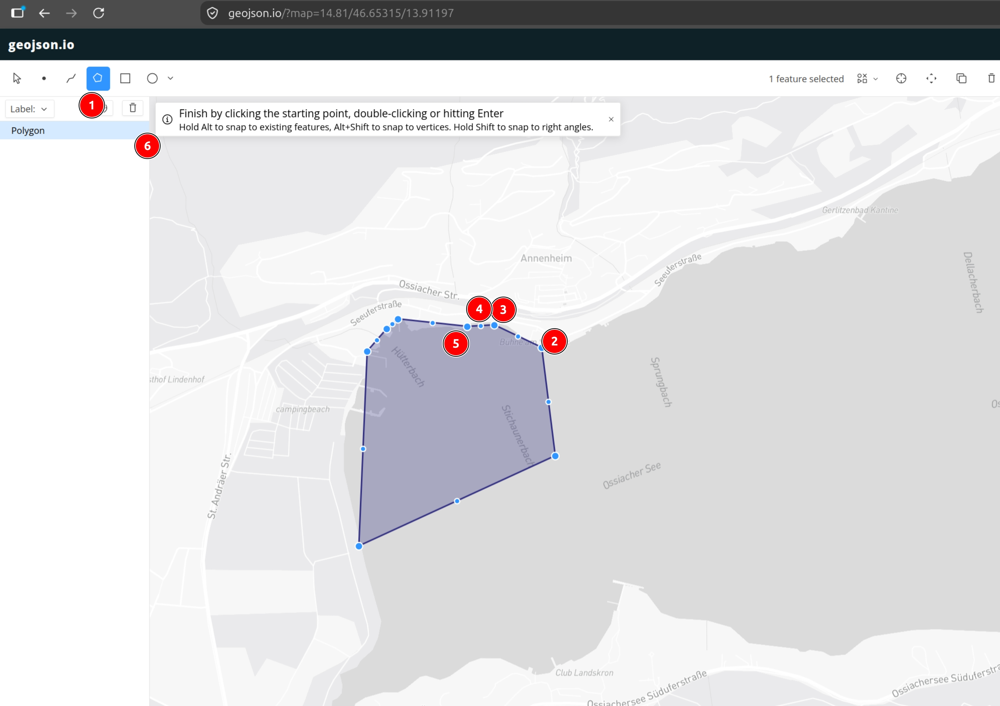
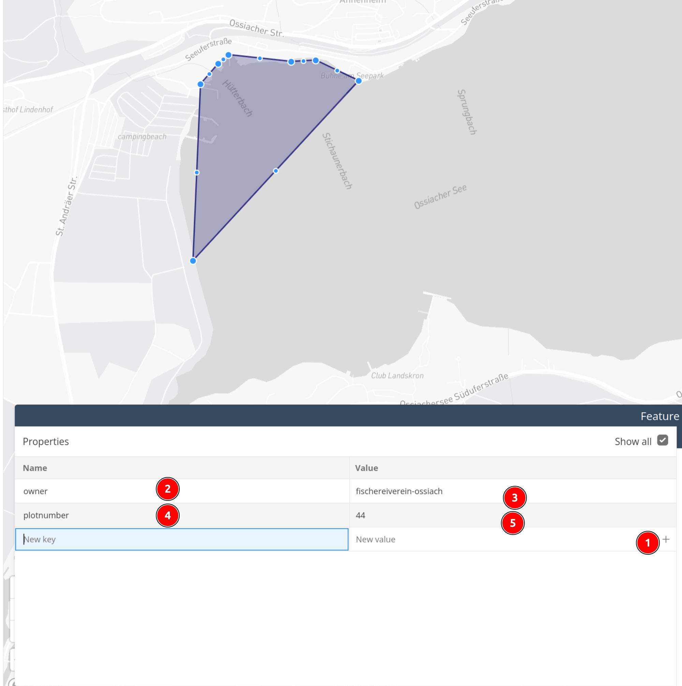

# austria-fishing-plot

Frontend-only Vue 3 + TypeScript + Leaflet app that shows the fishing plots ("Parzellen") of Austrian
lakes on basemap.at (standard map or aerial imagery, switchable), colors them according to the licenses
you own, and tells you which plot you are currently in via geolocation.

Live: https://berniburnsen.github.io/fishing-lake-plot/

## Run

```sh
npm install
npm run dev        # http://localhost:5173
npm run build      # type-check + production build into dist/
```

Geolocation only works on `localhost` or over HTTPS. Every push to `main` is deployed to GitHub Pages
by `.github/workflows/deploy.yml`.

## URL state

Everything is in the query string, so a view can be bookmarked or shared:

```
?lake=ossiacher-see&owner=fischereiverein-ossiach,revier-nord&mode=mine
```

| Param   | Values                                   | Default          |
|---------|------------------------------------------|------------------|
| `lake`  | a lake id from `src/lakes/index.ts`      | first lake       |
| `owner` | comma-separated owner ids you hold a license for | none     |
| `mode`  | `mine` (green = fishable, grey = not) or `all` (one color per owner, yours with black border) | `mine` |

Checkboxes and the mode toggle in the panel update the URL live.

## Drawing plots with geojson.io

The easiest way to create or edit plot polygons is [geojson.io](https://geojson.io). Open it, zoom to
the lake, then:



1. Select the **polygon tool**.
2. Click the first corner of the plot.
3. – 5. Click every further corner along the boundary. The more points along the shore, the better.
6. Finish by clicking the starting point, double-clicking or pressing Enter. The feature appears in the
   list on the left. Repeat for every plot.

Then click a polygon to open its properties and add the two required keys:



1. Use the **+** row to add a property.
2. – 3. Key `owner`, value = the owner id from the lake definition, e.g. `fischereiverein-ossiach`.
4. – 5. Key `plotnumber`, value = the official plot number, e.g. `44`.

Finally choose **Save → GeoJSON** in the top menu and put the downloaded file at
`src/lakes/<lake-id>/plots.json`. geojson.io may add style keys like `stroke` or `fill`; they are
ignored by the app and can stay or be deleted.

## Adding a lake

1. Create `src/lakes/<lake-id>/plots.json` – a GeoJSON `FeatureCollection` of `Polygon`/`MultiPolygon`
   features. Every feature needs `properties.plotnumber` (number or string) and `properties.owner`
   (an owner id). Optional `properties.note` is shown in the popup.
2. Create `src/lakes/<lake-id>/index.ts` exporting a `LakeDefinition` (id, name, center, zoom, owners
   with id/name/color, plots).
3. Register it in `src/lakes/index.ts`. A lake selector appears automatically once there is more than one.

The types live in `src/types.ts`.

## Ossiacher See test data

The four polygons in `src/lakes/ossiacher-see/plots.json` are test data. Only plot 44 has a real number,
the others are named `TEST-2..4`, and the three owners are placeholders. Replace them with the real
license holders.
